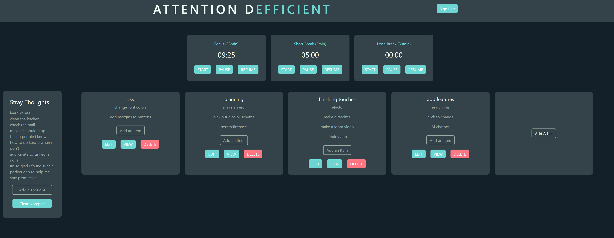

Attention dEfficient

All of your tools in one convenient screen

<!-- 
Create lists -->

Streamlined to-do item creation 

Track status of to-to items

See all items with details in single list view

 Overview:
 Attention dEfficient is a productivity manager designed to provide an organized, focus promoting environment to streamline user workflow. This web app is designed for the busy professional, a student with deadlines, freelancer managing multiple projects, or anyone that could benefit from a time management and goal oriented efficiency enhancer. 
 
 Key Features include:
 Organized task tracking: Users have easy access to create, edit, and delete to-do lists with status trackers for effortless organization and goal orientation.
 Time management features: Timers are provided for pomodoro style time management.
 Engaging user interface: User interface is optimized for user experience including sounds and animations that keep morale high and encourages continued use, keeping the user organized.

Tech Stack:
This app uses ReactJS, Bootstrap, a react-timer-hook, a use-sound hook, and Firebase.
Links to those hooks: 
https://www.joshwcomeau.com/react/announcing-use-sound-react-hook/#installation-3
https://www.npmjs.com/package/react-timer-hook?activeTab=code

Contributors:
 Tatiana Barga https://github.com/tatianabarga

Links and resources:
Project Board: https://github.com/users/tatianabarga/projects/4/views/1
Deplolyed Project: https://attention-defficient.netlify.app/
ERD: https://drawsql.app/teams/tatiana-bargas-team/diagrams/capstone
Wireframe: https://www.figma.com/file/6PlL8qdAZ5fsyStEtBT873/attention-defficient?type=design&node-id=2-3&mode=design&t=CBqLkDDjOK1Bj9Ha-0
Loom walkthrough:

how to download/clone/install and run the app:
    # React/Next.js Template

[See Live Demo of this Template](https://drt-next-js-template.netlify.app/)

## Topics
- [Get Started](#get-started)
- [Starting the Project](#starting-the-project)
- [Deploying on Netlify](#deploying-on-netlify)
___
## Getting Started
### Use Template
#### 1. To get started, click the GREEN "Use this Template" button at the top of the repo

#### 2. Make sure YOUR github account is selected in the dropdown and name your project

#### 3. Clone your new repo to your local machine
#### 4. Go to the **NEXT** section

## Starting the Project
1. Create a Firebase project and set up authentication. Use [these videos](https://vimeo.com/showcase/codetracker-firebase) as a refresher if needed.
1. Create a `.env` file at the root of the project
1. Copy/Paste the contents of the `.env.sample` file to your newly created `.env` file.
1. Copy over all of your Firebase values into the `.env` file.
1. Open the `package.json` file and change the `name` property to the name of your application, and `author` to  your name.
1. From your command line, be in the root directory and run `npm install` OR `npm i` for short.
1. Next, run `npm run prepare`. This command sets up husky to track eslint errors on commit that will make your deploy fail on Netlify.
1. go into the links for the hooks provided in the tech stack above and install hooks.
1. To start your application, run `npm run dev`. THIS IS THE COMMAND YOU WILL USE TO RUN YOUR DEVELOPMENT SERVER FROM NOW ON.
1. Open [http://localhost:3000](http://localhost:3000) with your browser.

You can start editing the page by modifying `pages/index.js`. The page auto-updates as you edit the file.

**NOTES:** 
- If you see the following error, you did not follow all the setup steps correctly and failed to add your Firebase creds. Go back and do that NOW.

### Deploying on Netlify
Netlify will automatically detect your project and prepopulate the settings, but should something go wrong and it does not, here are the commands:

- Build Command: `npm run build`
- Publish directory: `.next`

#### Additional Steps to Take on Netlify
- Add Environmental Variables
    - Any Enviromental variables you are using in your `.env` file should be added to Netlify. 
        - Go to Site settings > Build & deploy > Environment > Environment variables and the keys and values there.

- Update Firebase URL Settings
    - In Firebase under Authentication select sign in methods, scroll to Authorized domains. Add your Netlify URL.
        
## Learn More about Next.js
To learn more about Next.js, take a look at the following resources:

- [Next.js Documentation](https://nextjs.org/docs) - learn about Next.js features and API.
- [Learn Next.js](https://nextjs.org/learn) - an interactive Next.js tutorial.